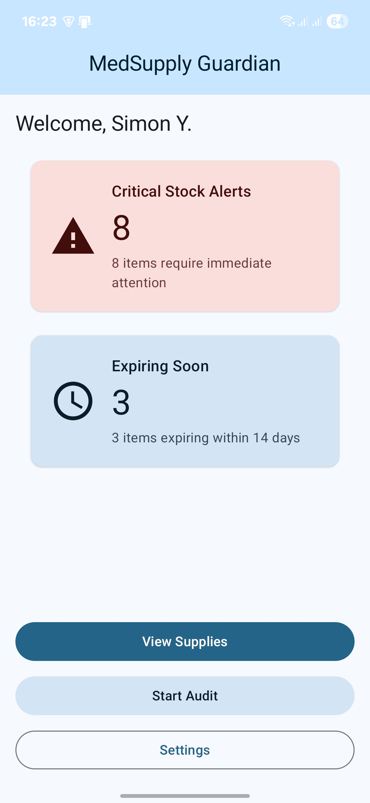
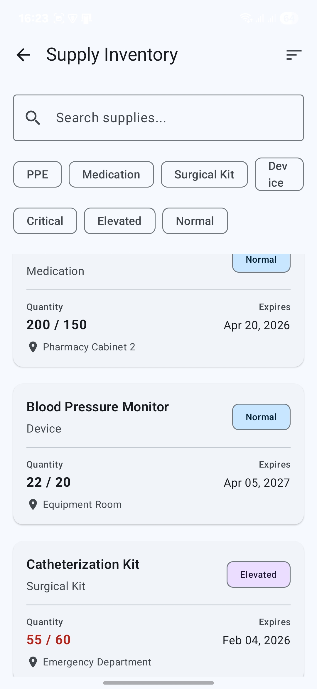
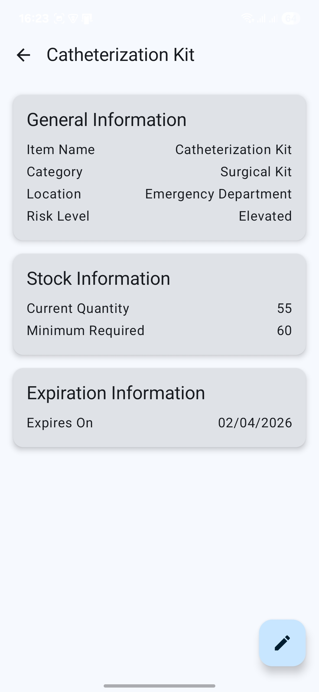
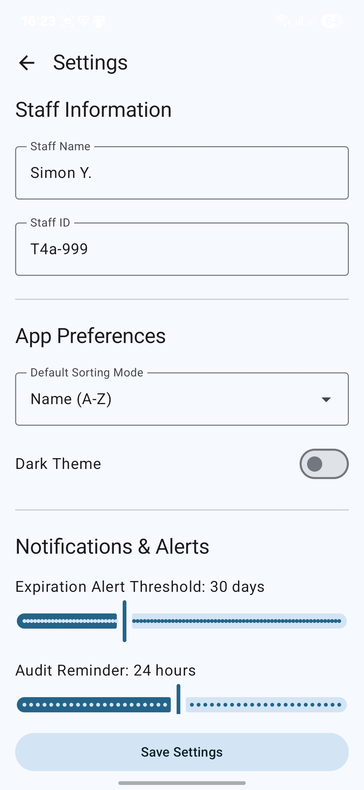
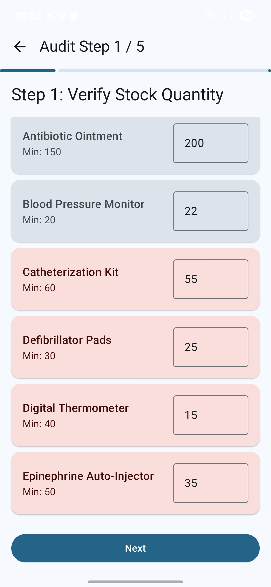
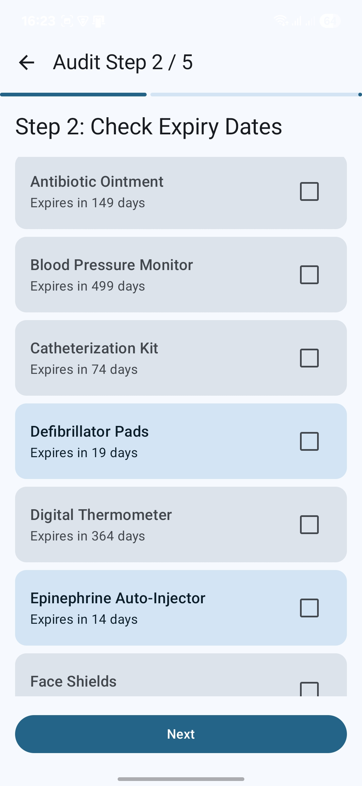
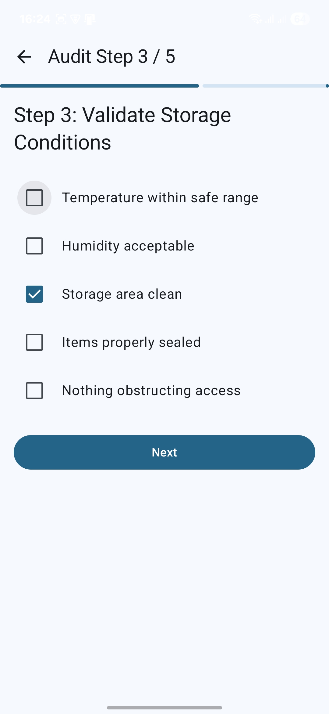
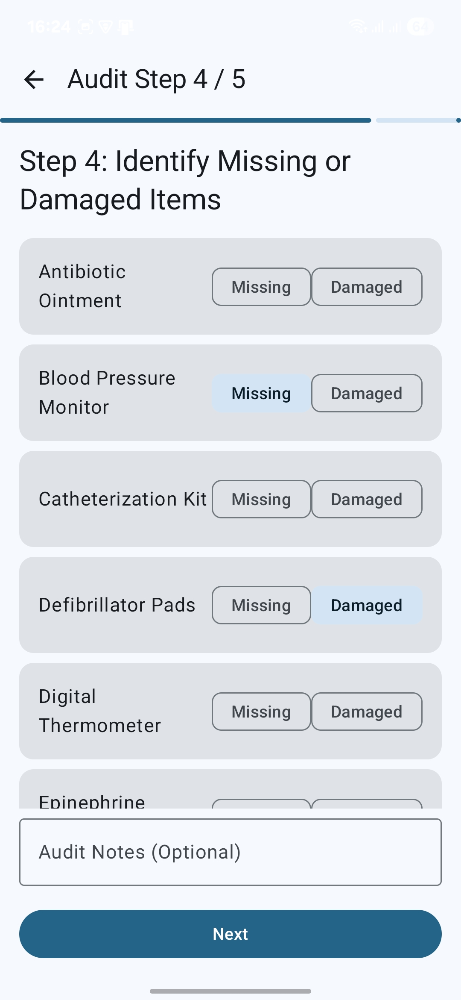

# MedSupply Guardian™

> Developed by: Sahil Patel

## Overview

MedSupply Guardian™ is an Android application designed to modernize and streamline the process of medical supply inventory management and compliance auditing in healthcare environments. It provides a mobile-first, offline-capable solution for supply technicians and nursing staff to ensure regulatory compliance, prevent stock shortages, and enhance patient safety.

## Core Features

-   **Dashboard:** An at-a-glance home screen summarizing critical stock levels and items that are expiring soon.
-   **Inventory Management:** A comprehensive list of all supply items, featuring real-time search, filtering by category and risk level, and multiple sorting options.
-   **Detailed Item View:** A detailed screen for each supply item, allowing for quick and easy quantity updates.
-   **Multi-Step Compliance Audit:** A guided, 5-step workflow for performing accurate and documented compliance audits, covering quantity verification, expiration checks, storage conditions, and discrepancy reporting.
-   **Persistent User Settings:** A dedicated settings screen to configure user identity, UI theme preferences (light/dark mode), and alert thresholds.

## Technical Architecture

The application is built entirely with Kotlin and follows modern Android development practices, emphasizing a reactive and lifecycle-aware architecture.

-   **UI Layer:** Jetpack Compose with Material 3 for a modern, declarative, and accessible user interface.
-   **State Management:** Android-native ViewModels and Kotlin Coroutines with StateFlow for robustly managing UI state.
-   **Data Persistence:**
    -   **Room Database:** For reliable, offline storage of the supply inventory and all audit records.
    -   **SharedPreferences:** For lightweight storage of user settings and application preferences.
-   **Navigation:** Jetpack Navigation Compose to manage a type-safe and consistent navigation graph throughout the application.
-   **Architecture Pattern:** Utilizes the Repository pattern to abstract data sources and provide a clean separation of concerns between the UI and data layers.

## Screenshots

| | | | |
|:---:|:---:|:---:|:---:|
|  |  |  |  |
|  |  |  |  |
